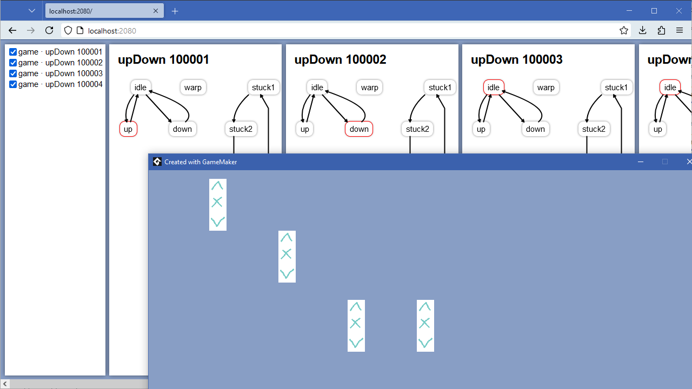

# SnowStateVis

**Quick links:** [documentation](https://yal-gamemaker.github.io/snowstatevis/)\
**Versions:** GM≥2023.4 (_not LTS!_)

SnowStateVis is a debugger-visualizer for
[SnowState](https://github.com/sohomsahaun/SnowState/),
a finite state machine library for GameMaker!

This system is in beta, by which I mean:
I wrote most of this code a while ago and I'm not sure
if I have forgotten anything important.

## How it works

-	You start a little server that'll be doing coordination between the game and the "watchers".\
	If you are testing on PC, the game itself can be hosting the server.
-	One or more games can connect to the server and tell it what state machines they have and what's happening to them.
-	One or more "watcher" (read: a webpage) can be opened to observe and manipulate (trigger state transitions) the aforementioned state machines.

## Setup and use

Check out the [docs](https://yal-gamemaker.github.io/snowstatevis/)!

## Technical

Overall it's pretty normal code?

For graphs, I build little SVGs.
The arrows occasionally don't _quite_ reach the state-blocks,
but I added a canvas renderer (see `debugGraph`) and apparently that's exactly
what comes out of `dagre`, so go figure;

There's a `Fader` class in the JS portion,
which is because CSS transitions do not offer the desired result
when quickly flipping between states;

There are 4 macros for ports in `obj_snowstatevis` total because we need:

1. A TCP/HTTP socket that serves files to the watcher(s)
2. A WS socket that serves events to the watcher(s)
3. A TCP socket for native games
4. A WS socket for HTML5 games

3 and 4 can be merged once GM's websocket implementation for native platforms matures a bit more.

1 and 2 could be merged (by doing an "upgrade"),
but I don't think that's worth the effort.

## TODOs

- Dark mode
- Support for (similar but different) Goal Oriented Action Planning

## Credits

- A system by YellowAfterlife
- Originally commissioned for [Soulbound](https://soulbound.game)
- Uses and built for [SnowState](https://github.com/sohomsahaun/SnowState/)
- Uses [HTGM](https://github.com/meseta/htgm/) for hosting a local web server
- Uses [dagre](https://github.com/dagrejs/dagre) to auto-build graphs for states based on their defined transitions